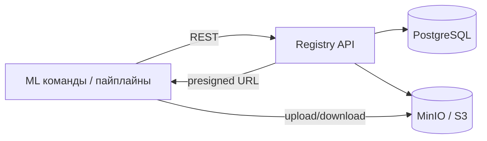

# Отчёт: Model Registry (с нуля)

## Цель

Сделать модельный реестр, который наводит порядок в хранении моделей. Сейчас модели лежат папками на общей машине, а нужно получить систему, где есть:

* понятные имена моделей,
* версии,
* метаданные (что за модель, на каких данных, какие метрики),
* стадии (draft/staging/production),
* удобный способ получить «текущую production».

---

## 1) Что не так в текущем сетапе

Дано: несколько команд складывают модели в директорию, примерно так:

```
models/
  mlds_1/my_model_v1/
  mlds_3/sft_modell_v_123/
  mlds_180/model_v1_v0_with_rank_dataset_0/
  ...
```

Проблемы:

1. **Непонятно, что внутри.** По папке нельзя определить ни автора, ни цель, ни качество.
2. **Нет связки с экспериментами.** Параметры, датасет, метрики и код обучения теряются.
3. **Версии «на глаз».** Нумерация и названия не являются контрактом, легко сделать дубль или перезаписать.
4. **Нет “production модели”.** Нельзя быстро ответить: «какую версию сейчас используем?»
5. **Риск потерь.** Папки можно случайно удалить/переместить, а истории изменений нет.
6. **Сложно интегрировать в прод.** Прод-сервису нужен простой запрос “дай production”, а сейчас это ручной поиск.

---

## 2) Требования

### Функциональные

* **Реестр моделей:** создать модель (name, owner, описание, теги), уметь искать/получать список.
* **Версии:** у модели есть версии 1..N; у версии есть метаданные (метрики, параметры, датасет/код, окружение).
* **Артефакты:** файл модели хранится отдельно, можно загрузить/скачать.
* **Стадии:** поддержать `draft → staging → production → archived`.
* **Promotion + аудит:** фиксировать кто/когда/почему перевёл версию в новую стадию.
* **Получение production:** эндпоинт, который возвращает текущую production-версию.

### Нефункциональные

* **Надёжность:** метаданные в БД, артефакты в хранилище.
* **Удобный запуск:** один `docker compose up`.
* **Не гонять большие файлы через API:** загрузка/скачивание напрямую в хранилище.
* **Дедупликация артефактов:** одинаковые файлы не плодить (по sha256).

---

## 3) Архитектура

Система из трёх основных компонентов:

* **Registry API (FastAPI)** — принимает запросы, создаёт модели/версии, управляет стадиями.
* **PostgreSQL** — хранит метаданные (модели, версии, стадии, аудит).
* **MinIO (S3)** — хранит файлы моделей (артефакты).

Схема:



Почему так:

* БД удобна для запросов и связей (модель → версии → аудит).
* Артефакты лучше хранить в S3-совместимом хранилище.
* Presigned URLs позволяют загружать/скачивать файлы напрямую, без проксирования через API.

---

## 4) API и схема БД

### API (основное)

* `POST /v1/models` — создать модель

* `GET /v1/models?query=&owner=&tag=` — список/поиск

* `GET /v1/models/{model_id}` — получить модель

* `POST /v1/models/{model_id}/versions` — создать версию

* `GET /v1/models/{model_id}/versions` — список версий

* `GET /v1/models/{model_id}/versions/{version}` — детали версии

* `GET /v1/models/{model_id}/production` — текущая production-версия

* `POST /v1/models/{model_id}/versions/{version}/promote` — перевести стадию (с комментарием)

* `POST /v1/artifacts/presign-upload` — получить presigned PUT

* `GET /v1/artifacts/presign-download?object_name=...` — получить presigned GET

* `POST /v1/artifacts/commit` — зафиксировать артефакт (sha256, size, uri)

### БД

* `models` — карточка модели (name, owner, tags)
* `model_versions` — версии + метаданные (metrics/params/dataset_ref/code_ref/stage)
* `artifacts` — артефакты (uri, sha256, size)
* `stage_transitions` — аудит промоушенов (from/to, actor, comment)

---

## 5) Где реализация

Код реализации находится в папке `registry/`:

* `registry/docker-compose.yml` — запуск API + Postgres + MinIO
* `registry/app/` — FastAPI приложение
* `registry/alembic/` — миграции
* `registry/README.md` — как запустить и примеры curl
