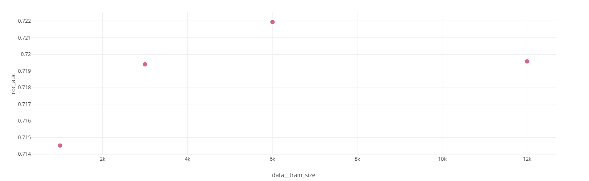
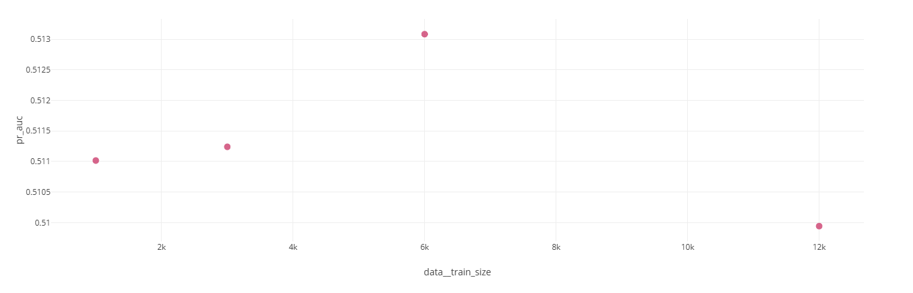
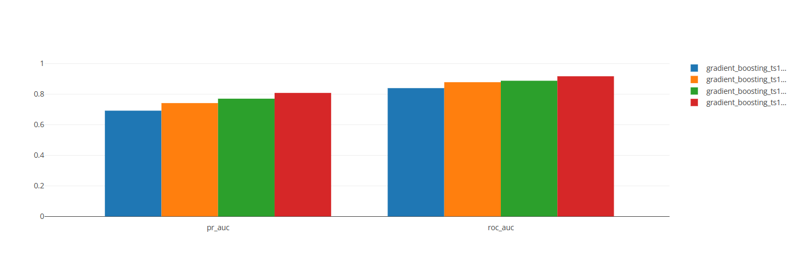
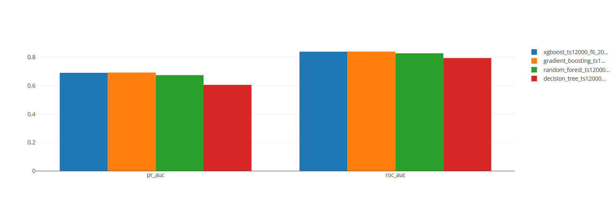
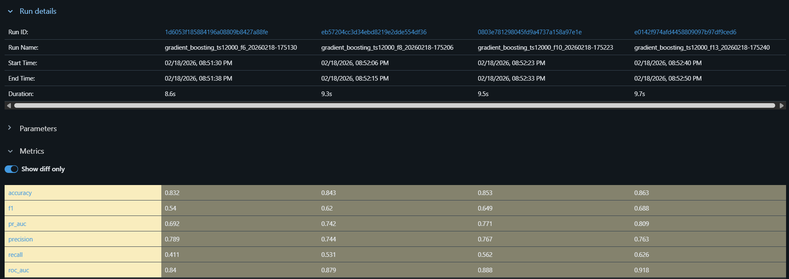
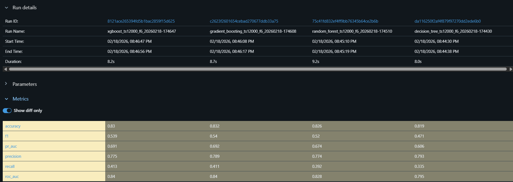

# Отчёт по экспериментам MLflow

Эксперимент: `homework_islamov`  
Ссылка MLflow: http://158.160.2.37:5000/

## 1) размер тренировочного датасета
**Гипотеза:** увеличение train_size улучшает качество (ROC-AUC/PR-AUC).  
**Фиксировали:** модель = logistic_regression, набор фич = f6.  
**Изменяли:** train_size = 1000, 3000, 6000, 12000.

Ключевые результаты (ROC-AUC):
- ts1000: 0.7145
- ts3000: 0.7194
- ts6000: 0.7219
- ts12000: 0.7196

**Вывод:** рост train_size даёт небольшой прирост до ~6000, далее эффекта особо нет.

## 2) тип модели
**Гипотеза:** ансамбли/бустинг дадут лучший ROC-AUC, чем одиночные модели.  
**Фиксировали:** train_size = 12000, фичи = f6.  
**Изменяли:** model_type = decision_tree, random_forest, gradient_boosting, xgboost.

Ключевые результаты (ROC-AUC):
- decision_tree (max_depth=6): 0.7946
- random_forest (n_estimators=200, max_depth=12): 0.8283
- gradient_boosting (n_estimators=200, lr=0.1, max_depth=3): 0.8402
- xgboost (n_estimators=300, max_depth=5, lr=0.1): 0.8396

**Вывод:** лучшие результаты дают бустинг/ансамбли; среди протестированных лидер gradient_boosting.

## 3) набор фич
**Гипотеза:** расширение набора фич повышает качество модели.  
**Фиксировали:** model_type = gradient_boosting, train_size = 12000.  
**Меняли:** f6 на f8 на f10 на f13.

Ключевые результаты (ROC-AUC):
- f6: 0.8402
- f8: 0.8790
- f10: 0.8885
- f13: 0.9178

### Скриншоты из MLflow UI

**Разрез: train_size**

**Разрез: model_type**

**Разрез: features**

**Таблица сравнения (MLflow Compare Metrics):**

**Таблица сравнения (MLflow Compare Metrics):**

**Вывод:** добавление информативных числовых и социальных признаков сильно улучшает качество.

## лучший запуск по ROC-AUC
ROC-AUC = 0.91784  
Ссылка: http://158.160.2.37:5000/#/experiments/23/runs/e0142f974afd4458809097b97df9ced6
