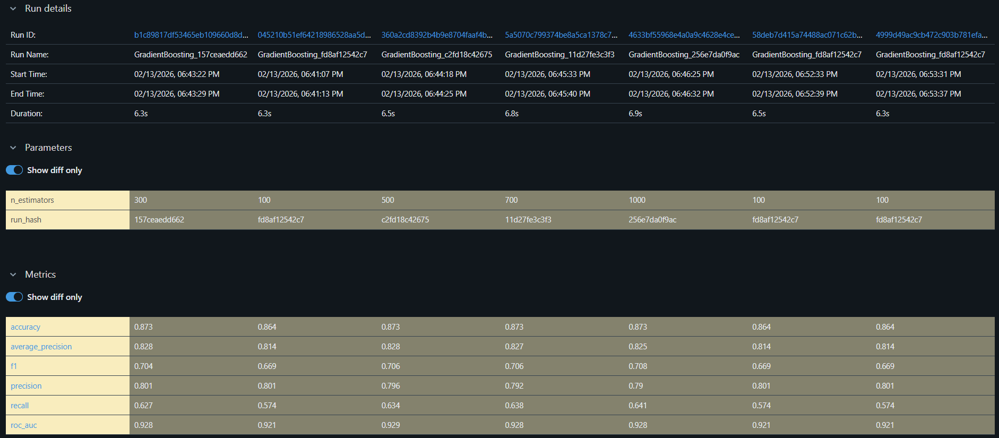
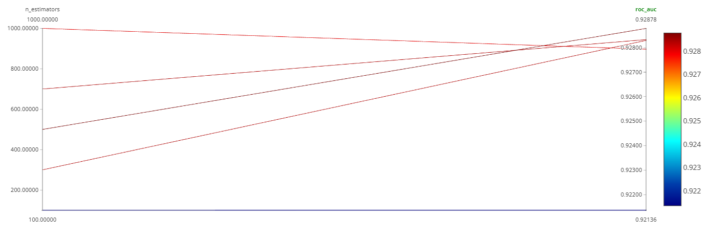

# Results: experiments of ulyanova

Эксперимент: `homework_ulyanova`  
MLflow: http://158.160.2.37:5000/

## Набор запусков для анализа
Для анализа выбраны 7 запусков одной модели **GradientBoosting** (один разрез, без смешивания осей).
В серии менялся только один параметр модели: `n_estimators` (число деревьев в ансамбле).

## 1) Разрез: n_estimators (GradientBoosting)
**Гипотеза:** увеличение `n_estimators` улучшает качество (ROC-AUC / PR-AUC) за счёт более сильного ансамбля, но после некоторого значения эффект выходит на плато.

**Фиксировали:** модель GradientBoosting, остальные параметры и пайплайн.  
**Меняли:** `n_estimators` = 100, 300, 500, 700, 1000 (в выборке есть несколько запусков с `n_estimators=100`, метрики совпадают).

### Скриншоты из MLflow UI
**Compare → Parameters/Metrics (7 runs):**  

**График зависимости (MLflow UI):**  

### Результаты (по таблице Compare)
Метрики (округление до 3 знаков):

| n_estimators | accuracy | PR-AUC (average_precision) | F1   | precision | recall | ROC-AUC |
|-------------|----------|----------------------------|------|-----------|--------|--------|
| 100         | 0.864    | 0.814                      | 0.669| 0.801     | 0.574  | 0.921 |
| 300         | 0.873    | 0.828                      | 0.704| 0.801     | 0.627  | 0.928 |
| 500         | 0.873    | 0.828                      | 0.706| 0.796     | 0.634  | 0.929 |
| 700         | 0.873    | 0.827                      | 0.706| 0.792     | 0.638  | 0.928 |
| 1000        | 0.873    | 0.825                      | 0.708| 0.790     | 0.641  | 0.928 |

### Наблюдения
- При увеличении `n_estimators` с **100 → 300** заметно растут метрики: ROC-AUC **~0.921 → ~0.928**, PR-AUC **~0.814 → ~0.828**, F1 **~0.669 → ~0.704**.
- Дальше (300 → 500 → 700 → 1000) ROC-AUC/PR-AUC выходят на **плато**: улучшения минимальны (ROC-AUC держится около **0.928–0.929**).
- При росте `n_estimators` увеличивается **recall** (0.574 → 0.641), но **precision** слегка снижается (0.801 → 0.790): модель начинает чаще “ловить” позитивный класс, но с чуть большим числом ложных срабатываний.

### Вывод
Гипотеза подтверждается частично: увеличение `n_estimators` улучшает качество до уровня ~300–500 деревьев, далее эффект становится слабым (плато).
Оптимальным по ROC-AUC среди выбранных запусков выглядит **n_estimators=500**.

## Лучший запуск по ROC-AUC
Лучший ROC-AUC ≈ **0.929** при `n_estimators=500`.  
Ссылка на run: http://158.160.2.37:5000/#/experiments/4/runs/360a2cd8392b4b9e8704faaf4b5b26ae